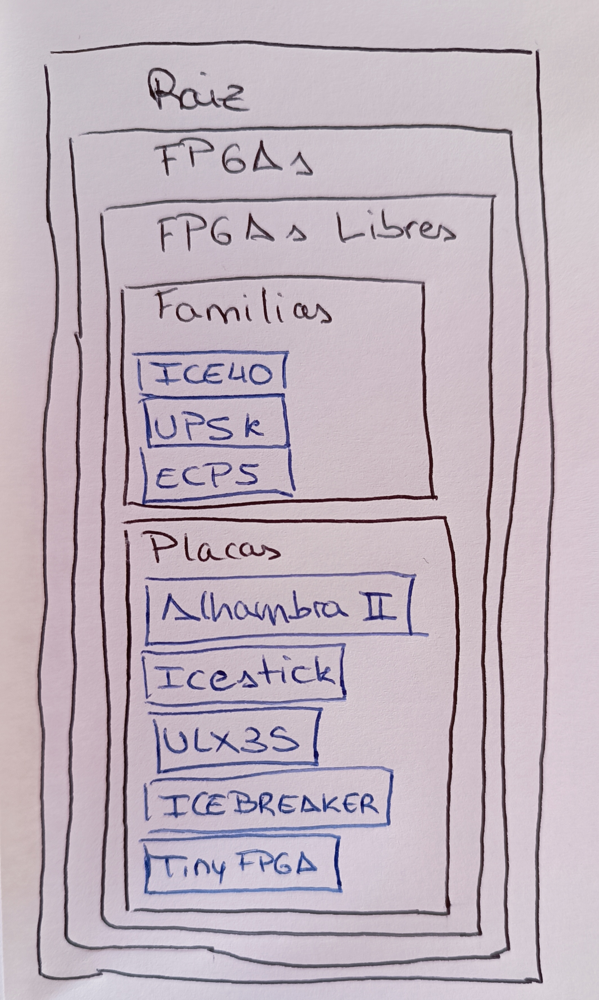
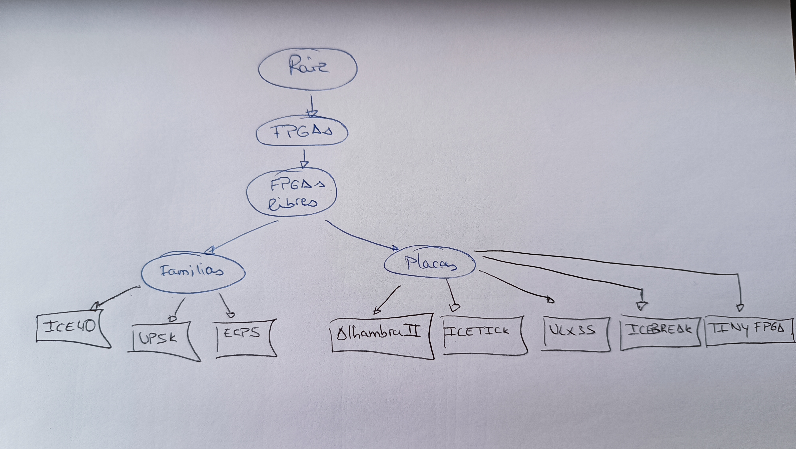

# FPGAs

## FPGAs libres

### Familias

* ice40
* UP5K
* ECP5

### Placas

1. Alhambra II
2. Icestick
3. ULX3S
4. iceBreaker
5. TinyFPGA

* a) Su diagrama de contenedores

* b) Su estructura en árbol

